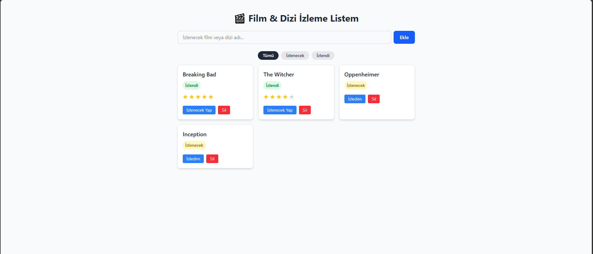
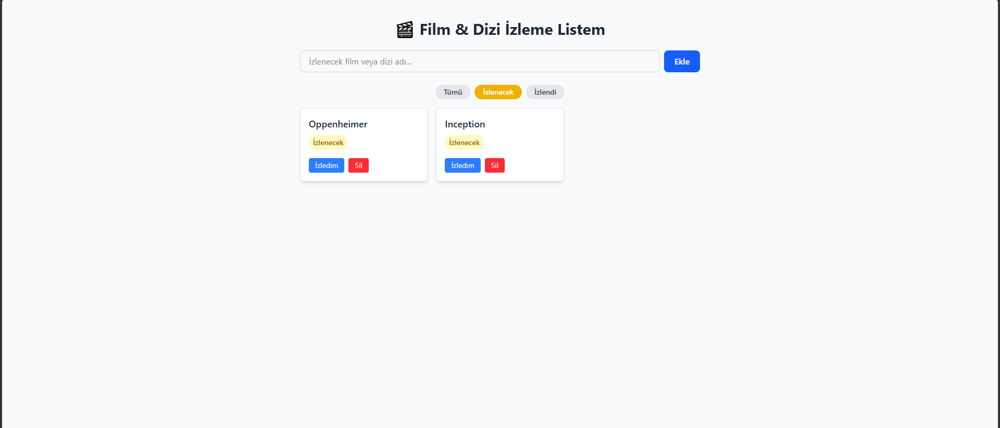
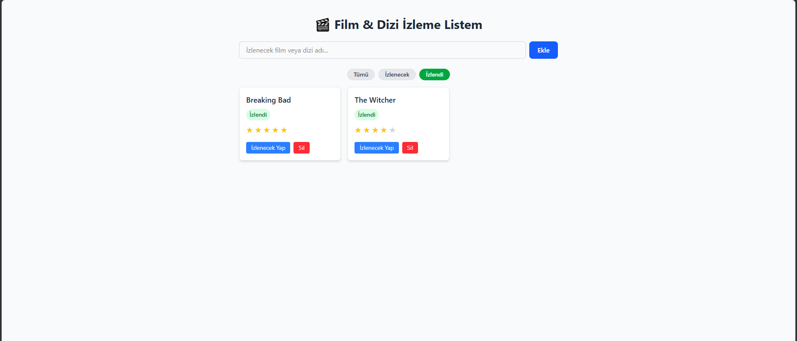

# 🎬 Film & Dizi İzleme Listesi

Bu proje, web geliştirme eğitimi kapsamında hazırladığım bitirme projesidir.
İzlemek istediğim film ve dizileri takip edebildiğim, basit bir liste uygulaması.

## Canlı Demo

🔗 [https://watchlist-web-app-huseyin.netlify.app/](https://watchlist-web-app-huseyin.netlify.app/)

## Ekran Görüntüleri

### Tüm Filmler

### İzlenecekler Filtresi

### İzlendi Filtresi

## Kullanılan Teknolojiler

- React (Vite ile kuruldu)
- Tailwind CSS
- LocalStorage (veriler tarayıcıda saklanıyor, backend yok)

## Özellikler

- Yeni film/dizi ekleme
- İzlenecek / İzlendi durumunu değiştirme
- İzlenen filmlere 1-5 arası puan verme
- Listeden film silme
- Tümü / İzlenecek / İzlendi olarak filtreleme
- Sayfa yenilense de veriler kaybolmuyor (LocalStorage sayesinde)

## Kurulum

\`\`\`
npm install
npm run dev
\`\`\`